<!--
  Profile README for github.com/dxk-labs
  Artwork lives in /assets and is generated by `py scripts/build_assets.py`.
  Anything in [SQUARE BRACKETS] is a placeholder: search "[" and fill them in.
-->

<picture>
  <source media="(prefers-color-scheme: dark)" srcset="assets/header-dark.svg">
  
</picture>

  
  
  

<picture>
  <source media="(prefers-color-scheme: dark)" srcset="assets/section-about-dark.svg">
  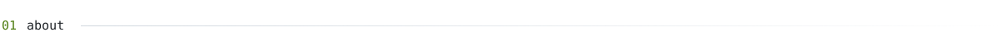
</picture>

**[YOUR NAME]** · [YOUR HEADLINE, e.g. "CS student @ University of X · builds apps & browser extensions"]

I build small, sharp tools for problems that annoy me, then ship them so they stop annoying everyone else.
So far that's a sleep-schedule app, a couple of browser extensions, and a Windows utility you control by slapping your laptop.

[ONE OR TWO LINES ABOUT WHAT YOU WANT NEXT, e.g. "Looking for a summer internship in mobile or web."]

<picture>
  <source media="(prefers-color-scheme: dark)" srcset="assets/section-experience-dark.svg">
  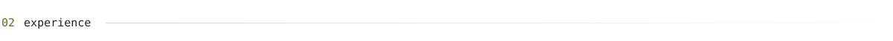
</picture>

| | |
|:--|--:|
| **Founder & developer** · dxk labs Designing, building and shipping mobile apps and browser extensions solo. Took Sleep Fixer from an App Inventor prototype to a Flutter rebuild with store-ready privacy, support and account-deletion pages. | 2021 – present |
| **[ROLE]** · [COMPANY / CLUB / VOLUNTEER GIG] [What you did, with a number in it if possible.] | [DATES] |
| **[ROLE]** · [COMPANY / CLUB / VOLUNTEER GIG] [What you did, with a number in it if possible.] | [DATES] |

<picture>
  <source media="(prefers-color-scheme: dark)" srcset="assets/section-projects-dark.svg">
  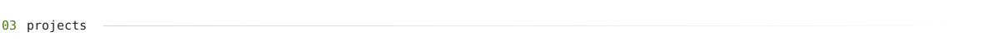
</picture>

  <a href="https://github.com/dxk-labs/sleep-fixer-legacy"><picture><source media="(prefers-color-scheme: dark)" srcset="assets/card-sleep-fixer-dark.svg">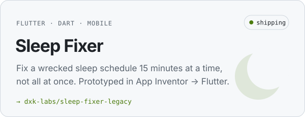</picture></a>
  <a href="https://github.com/dxk-labs/ask-chatgpt-extension"><picture><source media="(prefers-color-scheme: dark)" srcset="assets/card-ask-chatgpt-dark.svg">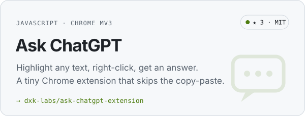</picture></a>

  <a href="[OUTLOOK_ROOMIER_REPO_URL]"><picture><source media="(prefers-color-scheme: dark)" srcset="assets/card-outlook-roomier-dark.svg">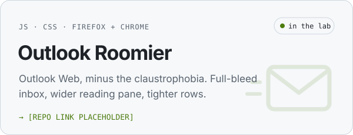</picture></a>
  <a href="[SLAPWINDOWS_REPO_URL]"><picture><source media="(prefers-color-scheme: dark)" srcset="assets/card-slapwindows-dark.svg">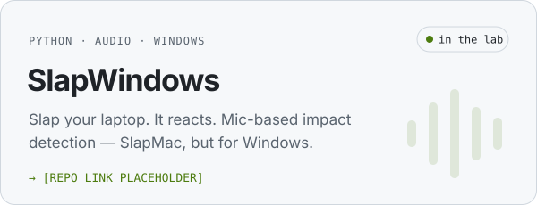</picture></a>

<picture>
  <source media="(prefers-color-scheme: dark)" srcset="assets/section-education-dark.svg">
  
</picture>

| | |
|:--|--:|
| **[DEGREE / YEAR LEVEL]** · [SCHOOL OR UNIVERSITY] Currently deep in C (pointers, `malloc`, the usual pain) and Python. [RELEVANT COURSES / GPA / AWARDS] | [DATES] |
| **[CERTIFICATION OR COURSE]** · [ISSUER] [Optional] | [DATE] |

<picture>
  <source media="(prefers-color-scheme: dark)" srcset="assets/section-stack-dark.svg">
  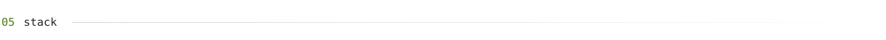
</picture>

  <picture>
    <source media="(prefers-color-scheme: dark)" srcset="https://skillicons.dev/icons?i=python,c,js,html,css,dart,flutter,chrome,firefox,git,github,vscode&theme=dark&perline=12">
    
  </picture>

<picture>
  <source media="(prefers-color-scheme: dark)" srcset="assets/section-activity-dark.svg">
  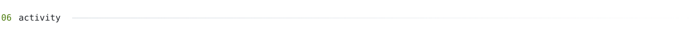
</picture>

<picture>
  <source media="(prefers-color-scheme: dark)" srcset="https://raw.githubusercontent.com/dxk-labs/dxk-labs/refs/heads/output/snake-dark.svg">
  
</picture>

<picture>
  <source media="(prefers-color-scheme: dark)" srcset="assets/section-contact-dark.svg">
  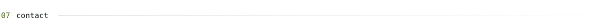
</picture>

  
  
  
  
  

<picture>
  <source media="(prefers-color-scheme: dark)" srcset="assets/footer-dark.svg">
  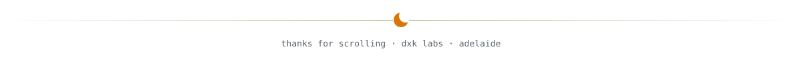
</picture>
