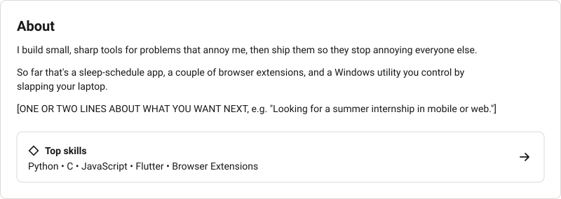
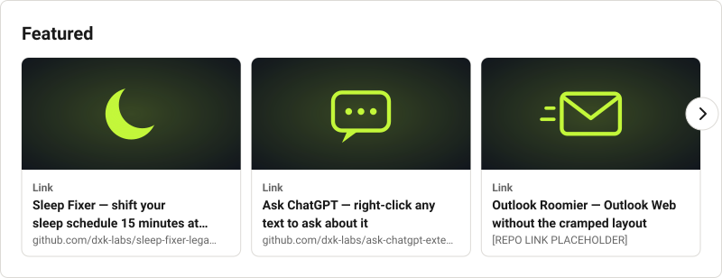
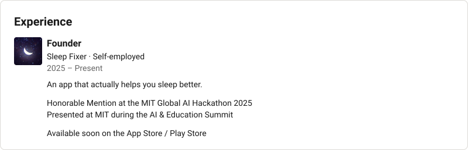
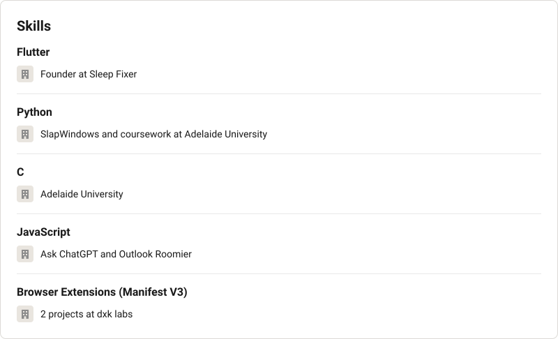

<!-- Generated by scripts/build_linkedin.py from linkedin.toml. Edit the TOML, not this file. -->

<picture><source media="(prefers-color-scheme: dark)" srcset="assets/li/top-dark.svg"></picture>

<picture><source media="(prefers-color-scheme: dark)" srcset="assets/li/about-dark.svg"></picture>

<a href="https://github.com/dxk-labs?tab=repositories"><picture><source media="(prefers-color-scheme: dark)" srcset="assets/li/featured-dark.svg"></picture></a>

<a href="https://github.com/dxk-labs/sleep-fixer-legacy">Sleep Fixer</a> · <a href="https://github.com/dxk-labs/ask-chatgpt-extension">Ask ChatGPT</a> · <a href="[OUTLOOK_ROOMIER_REPO_URL]">Outlook Roomier</a> · <a href="[SLAPWINDOWS_REPO_URL]">SlapWindows</a>

<picture><source media="(prefers-color-scheme: dark)" srcset="assets/li/experience-dark.svg"></picture>

<picture><source media="(prefers-color-scheme: dark)" srcset="assets/li/education-dark.svg"></picture>

<picture><source media="(prefers-color-scheme: dark)" srcset="assets/li/skills-dark.svg"></picture>

<picture><source media="(prefers-color-scheme: dark)" srcset="assets/li/contact-dark.svg"></picture>

<a href="https://github.com/dxk-labs">Profile</a> · <a href="[YOUR_WEBSITE_URL]">Website</a> · <a href="mailto:[YOUR_EMAIL]">Email</a>

