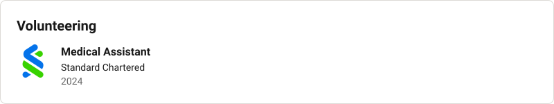
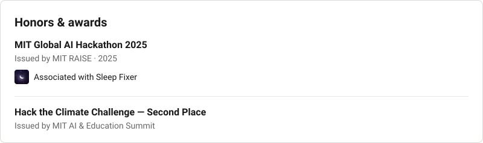

<!-- Generated by scripts/build_linkedin.py from linkedin.toml. Edit the TOML, not this file. -->

<picture><source media="(prefers-color-scheme: dark)" srcset="assets/li/top-dark.svg"></picture>

<picture><source media="(prefers-color-scheme: dark)" srcset="assets/li/experience-dark.svg"></picture>

<picture><source media="(prefers-color-scheme: dark)" srcset="assets/li/education-dark.svg"></picture>

<picture><source media="(prefers-color-scheme: dark)" srcset="assets/li/volunteering-dark.svg"></picture>

<picture><source media="(prefers-color-scheme: dark)" srcset="assets/li/honors-dark.svg"></picture>

<picture><source media="(prefers-color-scheme: dark)" srcset="assets/li/contact-dark.svg"></picture>

<a href="https://github.com/dxk-labs">Profile</a> · <a href="[YOUR_WEBSITE_URL]">Website</a> · <a href="mailto:[YOUR_EMAIL]">Email</a>

